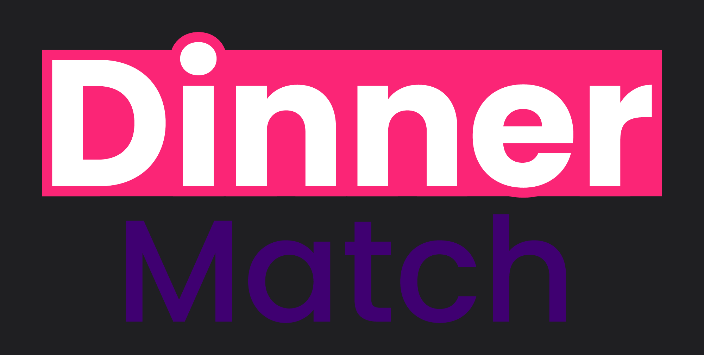
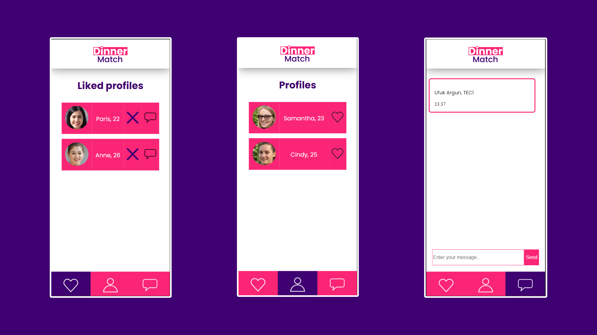
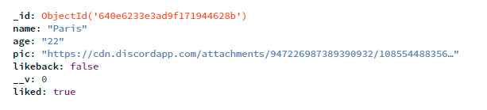

# BlokTech

22-23 Blok 3 Ufuk Argun

## DinnerMatch



## Concept

DinnerMatch is een matching-application die ontworpen is om iemand te vinden die met je samen diner wilt houden, of het in een chique restaurant is of bij je thuis.
Je kan profielen vinden, deze liken en uiteindelijk berichten.



## Opzetten

1. Download [Node.js](https://nodejs.org/en/) en installeer het op je systeem
2. Open de Terminal (Dit kan gedaan worden met CTRL + ` in Visual Studio Code)
3. Clone deze repository door de volgende commando uit te voeren in je terminal

```
git clone https://github.com/HibbaYT/BlokTech.git
```

4. Maak een database aan op [MongoDB](https://www.mongodb.com/)
5. Noem de database "DB_dinnermatch" en de collection "profiles"
6. De collection gebruikt 6 key's en values

- name: (voor de namen van de profielen)
- age: (voor de leeftijd van de profielen)
- pic: (voor de fotos van de profielen)
- likeback: (om te checken of de profiel ons terug liket)
- liked: (om zelf te profielen te liken en unliken)



[Hier](https://www.youtube.com/watch?v=6_NSkDRXPZk) is een tutorial hoe je met [MongoDB Atlas](https://www.mongodb.com/) de database kan opzetten 7. Installeer de bijbehorende modules door deze commando in je terminal te typen:

```
npm i express mongodb mongoose ejs dotenv
```

8. Creëer een .env bestand en richt deze op deze manier in:

```
MONGODB_URI=
PORT=
```
